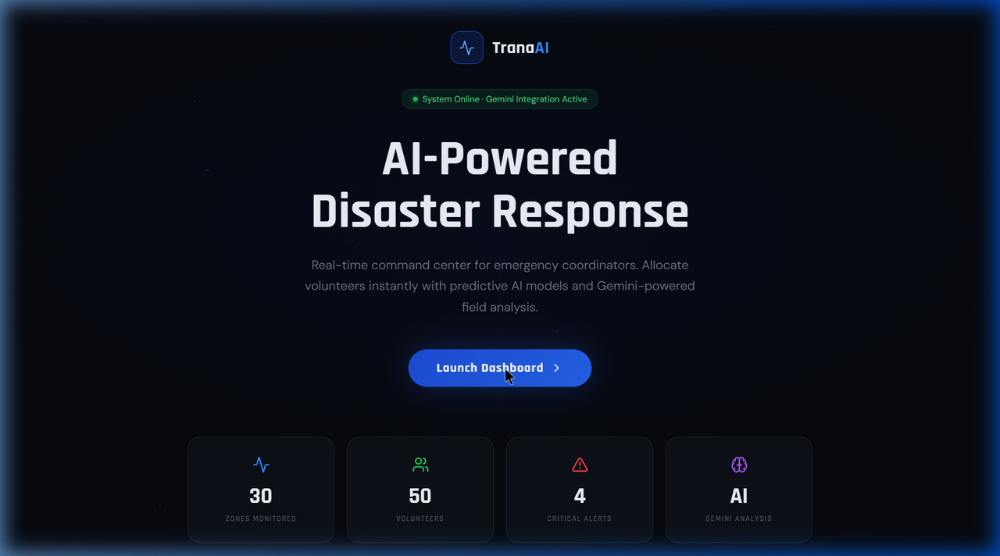
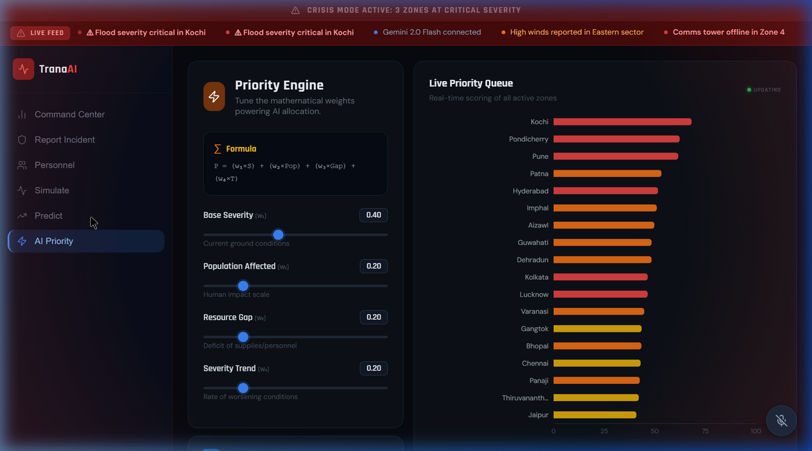
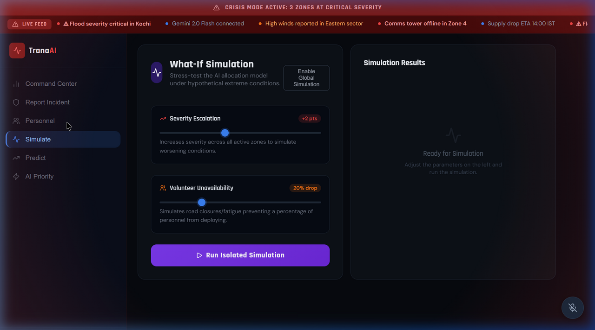
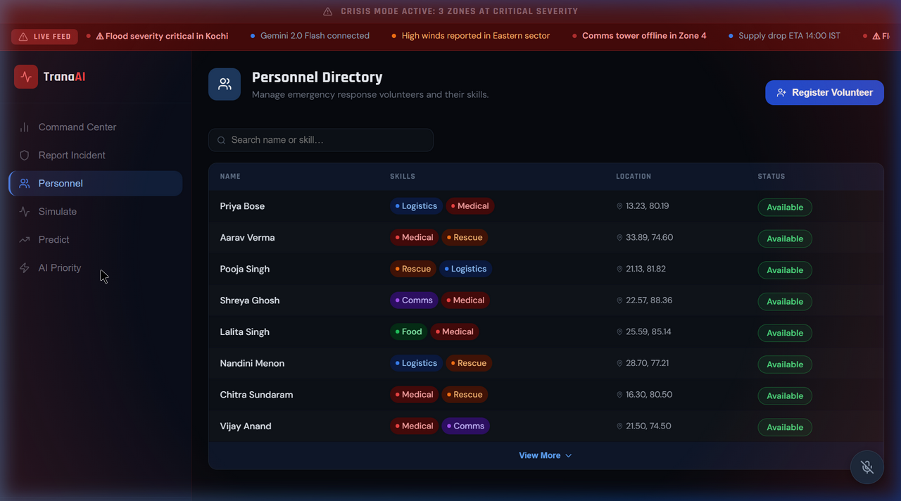

<p align="center">
  
  
  
  
</p>

<h1 align="center">🛡️ ReliefNet AI+</h1>

<p align="center">
  <strong>AI-Powered Disaster Response Command Center for India</strong>
</p>

<p align="center">
  Real-time crisis monitoring · Gemini-powered field analysis · Intelligent resource allocation<br/>
  72-hour predictive forecasting · Voice-activated command & control
</p>

---

<p align="center">
  <a href="https://reliefnet-ai.netlify.app">
    
  </a>
  &nbsp;&nbsp;
  <a href="https://app.netlify.com/start/deploy?repository=https://github.com/your-username/reliefnet-ai-plus">
    
  </a>
</p>

<p align="center">
  👉 <strong><a href="https://reliefnet-ai.netlify.app">https://reliefnet-ai.netlify.app</a></strong> 👈
</p>

---

## 🎮 Live Demo — Try It Now

> **No installation needed.** Open the link above and explore the full command center in your browser.

### Quick Start (Online Demo)

1. **Open** → [https://reliefnet-ai.netlify.app](https://reliefnet-ai.netlify.app)
2. **Click** → "Launch Dashboard" on the landing page
3. **Explore** → Navigate the Command Center, run AI Allocation, view the map
4. **Unlock AI** → Paste your free [Gemini API key](https://aistudio.google.com/) into the AI Priority or Prediction panels
5. **Try Voice** → Click the 🎙️ mic button → Say *"Run AI"*

### What Works Without an API Key

| Feature | Without Key | With Gemini Key |
|---------|:-----------:|:---------------:|
| Command Center & Map | ✅ | ✅ |
| AI Allocation Engine | ✅ | ✅ |
| What-If Simulation | ✅ | ✅ |
| Personnel Management | ✅ | ✅ |
| Incident Reporting | ✅ | ✅ |
| Voice Commands | ✅ | ✅ |
| Crisis Replay | ✅ | ✅ |
| 72-Hour Weather Forecast | ✅ | ✅ |
| Gemini AI Analysis | ❌ | ✅ |
| Prediction Briefings | ❌ | ✅ |
| Ask Gemini Q&A | ❌ | ✅ |

> 💡 **Get a free Gemini API key** at [aistudio.google.com](https://aistudio.google.com/) — takes 30 seconds. Keys stay in your browser only, never sent to any server.

---

## 📋 Table of Contents

- [Live Demo](#-live-demo--try-it-now)
- [Overview](#-overview)
- [Key Features](#-key-features)
- [Architecture](#-architecture)
- [Tech Stack](#-tech-stack)
- [Getting Started](#-getting-started)
- [Project Structure](#-project-structure)
- [Module Deep-Dive](#-module-deep-dive)
- [Google Technologies Used](#-google-technologies-used)
- [Data Sources](#-data-sources)
- [Screenshots](#-screenshots)
- [Deploy to Netlify](#-deploy-to-netlify)
- [Contributing](#-contributing)
- [License](#-license)

---

## 🌍 Overview

**ReliefNet AI+** is an AI-powered disaster response command center prototype built for the **Google Developer Groups (GDG) Hackathon**. It provides emergency coordinators with real-time situational awareness across **30 disaster zones** in India, combining live weather data, seismic monitoring, and Google Gemini AI to deliver actionable intelligence during crisis events.

The system goes beyond simple dashboards — it implements a **mathematical priority scoring engine**, **72-hour predictive forecasting** using real weather APIs, and **Gemini 2.0 Flash** for natural-language threat briefings and strategic recommendations.

### 🎯 Problem Statement

During natural disasters in India, emergency coordinators face:
- **Information overload** from multiple data sources
- **Manual resource allocation** that is slow and suboptimal
- **Lack of predictive capability** to pre-position resources
- **No unified command view** across affected zones

### 💡 Our Solution

ReliefNet AI+ addresses these challenges with:
- A **unified command center** that aggregates real-time data into a single operational view
- **AI-driven allocation** that mathematically scores zones and deploys volunteers optimally
- **72-hour predictive forecasting** using live weather and seismic data
- **Gemini AI integration** for strategic field reports and natural-language Q&A

---

## ✨ Key Features

### 1. 🗺️ Interactive Command Center
- **Google Maps Integration** with real-time disaster zone visualization
- Color-coded severity markers across 30 Indian cities
- AI-computed deployment flow lines (volunteer → zone)
- Drone telemetry simulation overlay with live feed visualization
- One-click **AI Allocation Engine** that scores and deploys resources

### 2. 🧠 AI Priority Engine (Gemini-Powered)
- Custom mathematical priority formula:
  ```
  P = (w₁ × Severity) + (w₂ × Population) + (w₃ × ResourceGap) + (w₄ × Trend)
  ```
- **Tunable weights** — coordinators adjust the algorithm in real time
- **Gemini 2.0 Flash** integration for strategic analysis
- AI Thinking visualization with step-by-step processing feedback
- Typewriter-effect rendering of AI field reports
- **Ask Gemini** — free-form natural language questions about the crisis

### 3. 🔮 72-Hour Predictive Forecast
- Live data from **Open-Meteo API** (precipitation, wind, temperature)
- Live seismic data from **USGS Earthquake API**
- Multi-hazard risk scoring across 4 threat vectors:
  | Threat | Weight | Data Source |
  |--------|--------|-------------|
  | Flood | 40% | Precipitation + probability |
  | Cyclone | 25% | Wind speed + storm codes |
  | Heatwave | 20% | Temperature thresholds |
  | Earthquake | 15% | USGS proximity analysis |
- **Gemini-generated prediction briefings** with confidence scores
- Heatmap overlay on Google India Map
- Auto-refresh every 10 minutes

### 4. ⚡ What-If Simulation Engine
- **Severity Escalation** slider (0–5 pts across all zones)
- **Volunteer Unavailability** simulation (0–80% drop)
- Isolated or Global simulation modes
- Post-simulation impact analysis with coverage rate metrics
- Real-time re-scoring when sliders change

### 5. 👥 Smart Personnel Management
- Volunteer directory with skill-based filtering
- **NLP-based skill extraction** from volunteer descriptions
- **Smart Deployment Match** — AI matches volunteers to optimal zones based on:
  - Skill compatibility (Medical → Earthquake, Rescue → Flood, etc.)
  - Zone severity scoring
- Auto-detect GPS location
- Paginated, sorted volunteer table

### 6. 📝 Disaster Input Panel
- Field reporting for new incidents
- Lat/Lng coordinate entry for precise zone creation
- Disaster type classification (Flood, Earthquake, Cyclone, Landslide, Fire, Drought)
- Severity assessment slider (1–10)
- Instant AI re-allocation on new incident submission

### 7. 🎙️ Voice Command Interface
- Web Speech API integration for hands-free operation
- Supported commands:
  - `"Run AI"` — Trigger AI allocation
  - `"Deploy rescue"` — Deploy rescue units
  - `"Increase severity"` — Escalate top zone severity
- Visual feedback with state indicators (Listening → Processing → Success/Error)

### 8. 🎬 Crisis Mode & Replay
- **Auto-triggered Crisis Mode** when any zone exceeds 8.5/10 severity
- Red-pulsing UI overlay for maximum urgency
- **Crisis Replay** — step through the last 10 state snapshots at 600ms intervals
- Real-time severity micro-updates every 8 seconds for live-data feel

---

## 🏗️ Architecture

```
┌─────────────────────────────────────────────────────────────┐
│                      ReliefNet AI+                          │
├─────────────────────────────────────────────────────────────┤
│                                                             │
│  ┌──────────┐  ┌──────────────┐  ┌────────────────────┐    │
│  │ Landing   │  │ Command      │  │ Prediction Engine  │    │
│  │ Page      │  │ Center       │  │ (72-hr Forecast)   │    │
│  └──────────┘  └──────┬───────┘  └────────┬───────────┘    │
│                       │                    │                │
│  ┌──────────┐  ┌──────┴───────┐  ┌────────┴───────────┐    │
│  │ AI       │  │ What-If      │  │ Personnel          │    │
│  │ Priority │  │ Simulation   │  │ Management         │    │
│  └────┬─────┘  └──────────────┘  └────────────────────┘    │
│       │                                                     │
├───────┴─────────────────────────────────────────────────────┤
│                    Zustand Store                            │
│  zones[] · personnel[] · weights{} · predictions[]         │
│  aiAllocations[] · mapPolylines[] · stateHistory[]         │
├─────────────────────────────────────────────────────────────┤
│                   External Services                         │
│  Google Gemini 2.0 Flash · Open-Meteo API · USGS API      │
│  Google Maps JavaScript API · Web Speech API               │
└─────────────────────────────────────────────────────────────┘
```

---

## 🛠️ Tech Stack

| Layer | Technology | Purpose |
|-------|-----------|---------|
| **Framework** | React 19 + Vite 8 | UI rendering & fast HMR |
| **State** | Zustand 5 | Global state management |
| **Maps** | @react-google-maps/api | Google Maps integration |
| **Charts** | Recharts 3 | Priority queue visualization |
| **Icons** | Lucide React | Consistent iconography |
| **AI** | Google Gemini 2.0 Flash | Strategic analysis & prediction briefings |
| **Weather** | Open-Meteo API | 72-hour forecast data |
| **Seismic** | USGS Earthquake API | Real-time earthquake monitoring |
| **Voice** | Web Speech API | Voice command interface |
| **Styling** | Vanilla CSS | Custom dark-mode command center theme |
| **Language** | JavaScript + TypeScript | Mixed (services in TS, components in JSX) |

---

## 🚀 Getting Started

### Prerequisites

- **Node.js** ≥ 18
- **pnpm** (recommended) or npm
- **Google Gemini API Key** — [Get free key at aistudio.google.com](https://aistudio.google.com/)
- **Google Maps API Key** — [Google Cloud Console](https://console.cloud.google.com/)

### Installation

```bash
# Clone the repository
git clone https://github.com/your-username/reliefnet-ai-plus.git
cd reliefnet-ai-plus

# Install dependencies
pnpm install

# Create environment file (optional — keys can also be entered in-app)
echo "VITE_GEMINI_API_KEY=your_gemini_api_key_here" > .env
echo "VITE_GOOGLE_MAPS_KEY=your_maps_key_here" >> .env

# Start development server
pnpm dev
```

The app will be available at `http://localhost:5173/`

### Environment Variables

| Variable | Required | Description |
|----------|----------|-------------|
| `VITE_GEMINI_API_KEY` | Optional | Google Gemini API key (can enter in-app) |
| `VITE_GOOGLE_MAPS_KEY` | Optional | Google Maps JavaScript API key |

> **Note:** Both API keys can be entered directly in the application UI if not set as environment variables. Keys are stored only in browser memory — never sent to any backend.

---

## 📁 Project Structure

```
reliefnet-ai-plus/
├── index.html                  # Entry HTML with SEO meta tags
├── package.json                # Dependencies & scripts
├── tsconfig.json               # TypeScript configuration
├── src/
│   ├── main.jsx                # React DOM mount point
│   ├── App.jsx                 # Root router & layout orchestrator
│   ├── index.css               # Global styles, animations, dark theme
│   ├── style.css               # Additional component styles
│   │
│   ├── pages/
│   │   ├── Landing.jsx         # Cinematic landing with count-up animations
│   │   ├── CommandCenter.jsx   # Main 3-column operations dashboard
│   │   ├── PredictPage.jsx     # 72-hour AI prediction module
│   │   ├── AIPriority.jsx      # Priority engine + Gemini analysis
│   │   ├── Simulate.jsx        # What-if simulation engine
│   │   ├── Personnel.jsx       # Volunteer directory & smart matching
│   │   └── ReportIncident.jsx  # New incident reporting form
│   │
│   ├── components/
│   │   ├── GoogleIndiaMap.jsx  # Google Maps with zone markers & polylines
│   │   ├── IndiaMap.jsx        # SVG fallback map of India
│   │   ├── Sidebar.jsx         # Navigation sidebar
│   │   ├── AlertTicker.jsx     # Scrolling crisis alert banner
│   │   ├── VoiceCommand.jsx    # Speech recognition interface
│   │   ├── ZoneDetailCard.jsx  # Zone detail panel with metrics
│   │   ├── LiveClock.jsx       # Real-time clock display
│   │   ├── SharedComponents.jsx# Reusable UI primitives
│   │   └── WowFeatures.jsx     # Crisis mode, impact panel, AI thinking
│   │
│   ├── store/
│   │   └── index.js            # Zustand store (zones, personnel, predictions)
│   │
│   ├── services/
│   │   ├── predictionService.ts # Open-Meteo + USGS data fetching
│   │   └── geminiPrediction.ts  # Gemini prediction briefing generation
│   │
│   ├── utils/
│   │   ├── gemini.js           # Gemini API client, prompt builder, formatter
│   │   ├── riskScorer.ts       # Multi-hazard risk calculation engine
│   │   └── helpers.js          # Utility functions (severity colors, formatting)
│   │
│   ├── data/
│   │   ├── zones.js            # 30 disaster zones across India + GeoJSON
│   │   └── personnel.js        # Volunteer data generator
│   │
│   └── types/
│       └── prediction.ts       # TypeScript interfaces for prediction data
```

---

## 🔬 Module Deep-Dive

### Priority Scoring Algorithm

The core allocation engine uses a weighted composite score:

```
P(zone) = w₁ × (severity / 10) + w₂ × min(pop / 400K, 1) + w₃ × min((20 - res) / 20, 1) + w₄ × min(max(trend, 0) / 2, 1)
```

| Weight | Default | Factor | Rationale |
|--------|---------|--------|-----------|
| w₁ | 0.40 | Base Severity | Ground truth conditions |
| w₂ | 0.20 | Population | Human impact scale |
| w₃ | 0.20 | Resource Gap | Supply deficit urgency |
| w₄ | 0.20 | Severity Trend | Rate of deterioration |

All weights are **user-tunable in real time** via the Priority Engine panel.

### Multi-Hazard Risk Scorer

The prediction engine calculates individual risk scores per threat type:

- **Flood Risk (40%)** — Precipitation volume, probability thresholds, and geographic vulnerability (Patna, Mumbai, Bhubaneswar, etc.)
- **Cyclone Risk (25%)** — Wind speed > 60 km/h, storm weather codes, coastal proximity
- **Heatwave Risk (20%)** — Temperature > 42°C critical, > 38°C elevated, arid city bonus
- **Earthquake Risk (15%)** — USGS events within 200km radius, magnitude > 5.5 critical

Uses the **Haversine formula** for geographic distance calculations between cities and seismic events.

### Gemini AI Integration Points

| Feature | Model | Purpose |
|---------|-------|---------|
| Strategic Analysis | gemini-2.0-flash | Risk assessment, resource allocation plans |
| Ask Gemini (Q&A) | gemini-2.0-flash | Free-form coordinator questions |
| Prediction Briefings | gemini-2.0-flash | 72-hr threat forecast with confidence scores |
| Prompt Engineering | Custom | Structured output (JSON for briefings, markdown for reports) |

---

## 🔵 Google Technologies Used

| Technology | Integration |
|------------|-------------|
| **Google Gemini 2.0 Flash** | Core AI engine for strategic analysis, prediction briefings, and Q&A |
| **Google Maps JavaScript API** | Interactive map with severity markers, deployment polylines, and heatmap overlay |
| **Google Fonts (Rajdhani)** | Military-grade typography throughout the UI |
| **Web Speech API (Chrome)** | Voice command interface for hands-free operation |

---

## 📡 Data Sources

| Source | Data | Update Frequency |
|--------|------|-------------------|
| [Open-Meteo API](https://open-meteo.com/) | 72-hour hourly weather forecasts (precip, wind, temp, weather codes) | Every 10 min |
| [USGS Earthquake API](https://earthquake.usgs.gov/) | M2.5+ earthquakes, past 7 days, India bounding box | Every 10 min |
| Internal Zone Data | 30 Indian cities with severity, population, resource levels | Real-time simulation |
| Google Gemini | AI-generated threat analysis and prediction reasoning | On-demand |

---

## 🖼️ Screenshots

### Landing Page
> Cinematic entry with animated count-up stats, system status indicators, and gradient launch button.



---

### Command Center
> 3-column layout: Top 10 critical zones (left), Google Maps with markers + deployment lines (center), AI Command Suggestions + zone detail (right).


---

### AI Priority Engine
> Tunable weight sliders, live priority queue bar chart, Gemini AI thinking visualization, and typewriter-rendered field reports.



---

### 72-Hour Prediction
> City risk cards with multi-hazard breakdown bars, forecast detail overlay on map, and Gemini-generated national summary with recommended actions.


---

### What-If Simulation
> Stress-test controls for severity escalation and volunteer dropout, with post-simulation impact cards and top zone rankings.



---

### Personnel Directory
> Volunteer management with skill badges, search filtering, and smart deployment matching.



---

## 🧪 Demo Flow (Recommended for Judges)

1. **Landing** → Click "Launch Dashboard" for cinematic entry
2. **Command Center** → Click "Run AI Allocation" to see deployment flow lines appear on the map
3. **Command Center** → Click a zone on the left panel to see drone telemetry overlay
4. **Command Center** → Click "Replay Crisis" to see state history playback
5. **AI Priority** → Enter Gemini API key → Run AI Analysis → Watch thinking animation + typewriter output
6. **AI Priority** → Switch to "Ask Gemini" tab → Ask: *"Which zone needs medical teams urgently?"*
7. **Prediction** → View live 72-hour forecast → Click a city to see risk breakdown
8. **Simulation** → Set severity +3, volunteer drop 40% → Run simulation → See impact
9. **Personnel** → Register a new volunteer → Describe as "doctor with boat" → Smart Deploy Match
10. **Report Incident** → Submit a new zone → Watch it appear on the map
11. **Voice** → Click mic → Say "Run AI" → Watch allocation execute

---

## 🌐 Deploy to Netlify

Deploy your own instance of ReliefNet AI+ to Netlify in under 5 minutes:

### Option 1: One-Click Deploy

[](https://app.netlify.com/start/deploy?repository=https://github.com/your-username/reliefnet-ai-plus)

### Option 2: Manual Deployment

```bash
# 1. Build the production bundle
pnpm build

# 2. Install Netlify CLI (if not installed)
npm install -g netlify-cli

# 3. Login to Netlify
netlify login

# 4. Deploy (first time — creates new site)
netlify deploy --prod --dir=dist
```

### Option 3: Git-Connected Deploy (Recommended)

1. **Push to GitHub** — Push your code to a GitHub repository
2. **Connect Netlify** — Go to [app.netlify.com](https://app.netlify.com) → "Add new site" → "Import an existing project"
3. **Configure build settings:**

   | Setting | Value |
   |---------|-------|
   | Build command | `pnpm build` or `npm run build` |
   | Publish directory | `dist` |
   | Node version | `18` or higher |

4. **Set Environment Variables** (optional — keys can be entered in-app):
   - `VITE_GEMINI_API_KEY` → Your Gemini API key
   - `VITE_GOOGLE_MAPS_KEY` → Your Google Maps API key

5. **Deploy** → Netlify will auto-build and deploy on every push

### Post-Deploy Checklist

- [ ] Update the live demo URL in this README (replace `reliefnet-ai.netlify.app` with your actual Netlify URL)
- [ ] Update the GitHub repo URL in the Deploy button link
- [ ] Verify Google Maps loads correctly (may need to add Netlify domain to Maps API allowed referrers)
- [ ] Test Gemini API key entry in-app
- [ ] Share the link with judges! 🎉

> ⚠️ **Important:** After deploying, update the placeholder URL `https://reliefnet-ai.netlify.app` in this README with your actual Netlify deployment URL.

---

## 🤝 Contributing

This is a hackathon prototype. Contributions are welcome for:

- [ ] Backend persistence (Firebase/Supabase)
- [ ] Real-time multi-user collaboration (WebSocket)
- [ ] Mobile-responsive layout
- [ ] PWA offline support
- [ ] Integration with IMD (India Meteorological Department) APIs
- [ ] Multi-language support (Hindi, Tamil, Bengali)

---

## 👨‍💻 Team

<table>
  <tr>
    <td align="center">
      <a href="https://github.com/username1">
        <br/>
        <sub><b>Member Name 1</b></sub>
      </a><br/>
      <sub>Frontend & UI/UX</sub>
    </td>
    <td align="center">
      <a href="https://github.com/username2">
        <br/>
        <sub><b>Member Name 2</b></sub>
      </a><br/>
      <sub>AI/ML & Gemini Integration</sub>
    </td>
    <td align="center">
      <a href="https://github.com/username3">
        <br/>
        <sub><b>Member Name 3</b></sub>
      </a><br/>
      <sub>Backend & Data Pipeline</sub>
    </td>
    <td align="center">
      <a href="https://github.com/username4">
        <br/>
        <sub><b>Member Name 4</b></sub>
      </a><br/>
      <sub>Maps & Visualization</sub>
    </td>
  </tr>
</table>

> 🏫 **Team Name** — ROOKIES
>
> ⚠️ *Replace the placeholder names, GitHub usernames, and roles above with your actual team details.*

---

## 📄 License

This project is built for the **** and is available under the [MIT License](LICENSE).

---

<p align="center">
  <strong>Built with ❤️ for disaster resilience in India</strong><br/>
  <em>Powered by Google Gemini · Google Maps · Open-Meteo · USGS</em>
</p>
